# aws-codestar-laravel-sample 🐳

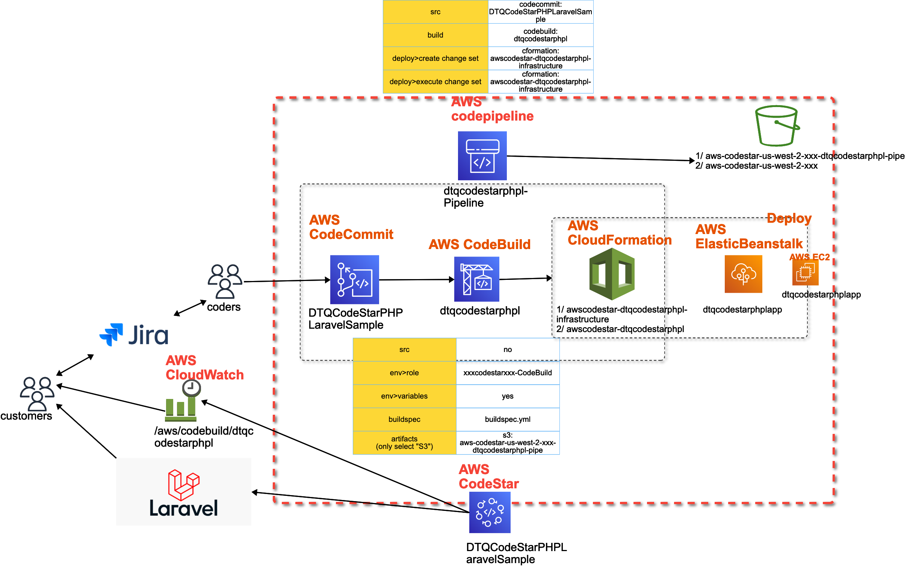

## AWS Codestar
### 1) template
- select `PHP > Laravel + AWS EB`
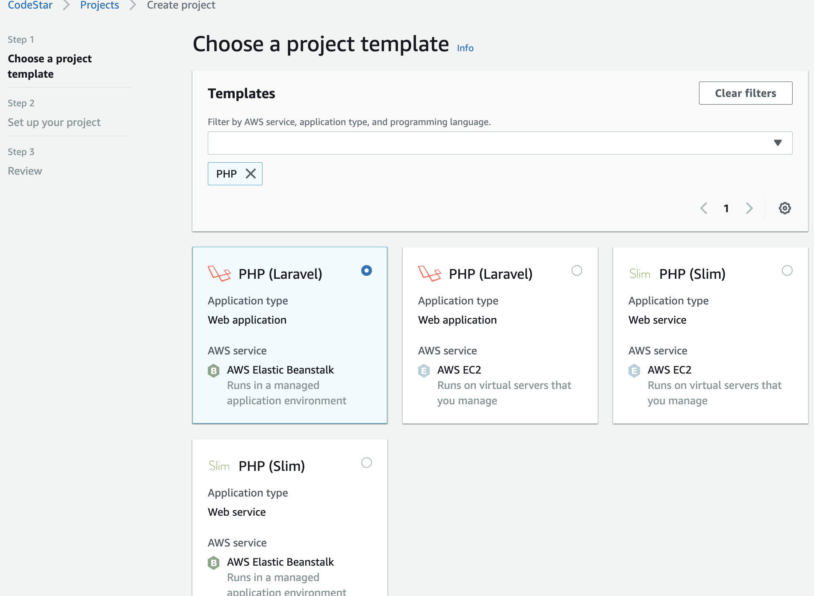
### 2) IDE
- use `AWS CodeCommit`
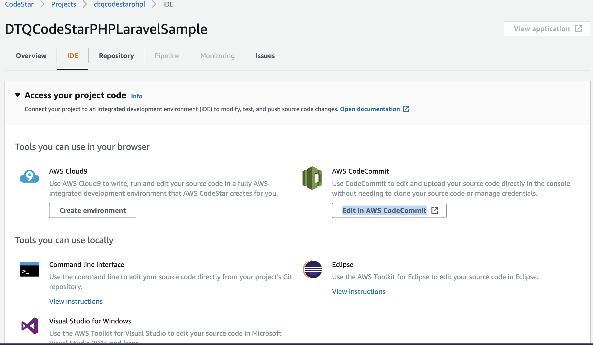
### 3) src code
- use `AWS CodeCommit`
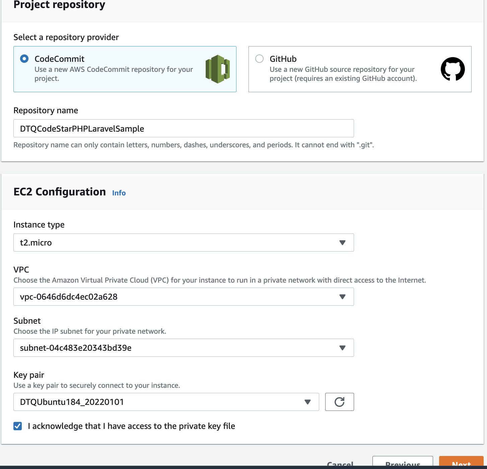
### 4) create
- wait until finish
### 5) repo
- check info of `AWS CodeCommit`
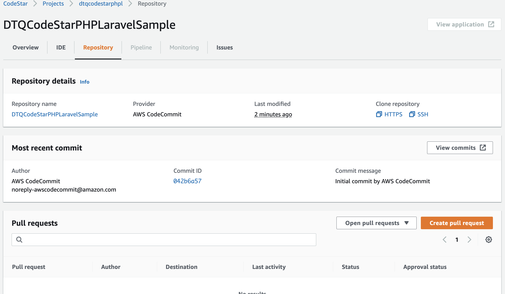
### 6) pipeline
- same with AWS CodePipeline=`dtqcodestarphpl-Pipeline`
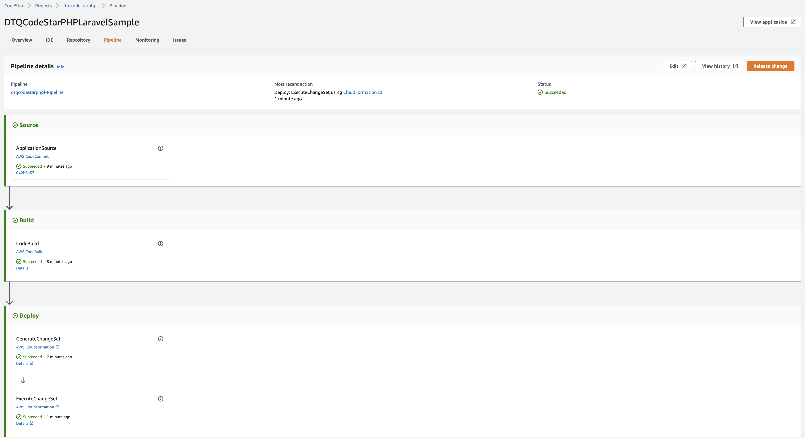
---
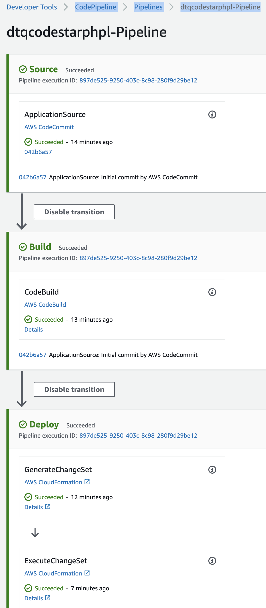
### 7) issues
- use `Jira`, need admin right!!!
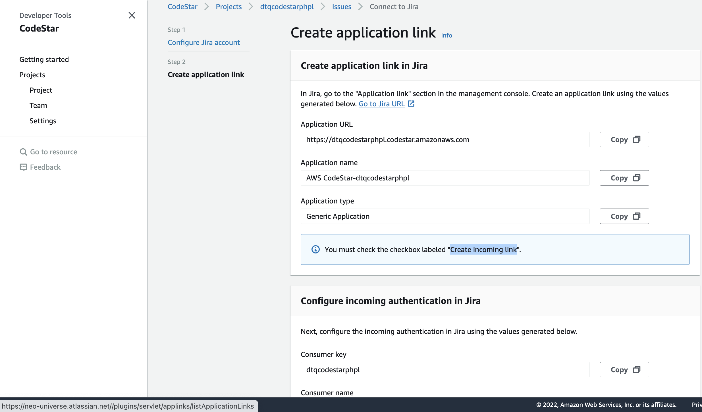
### 8) team member
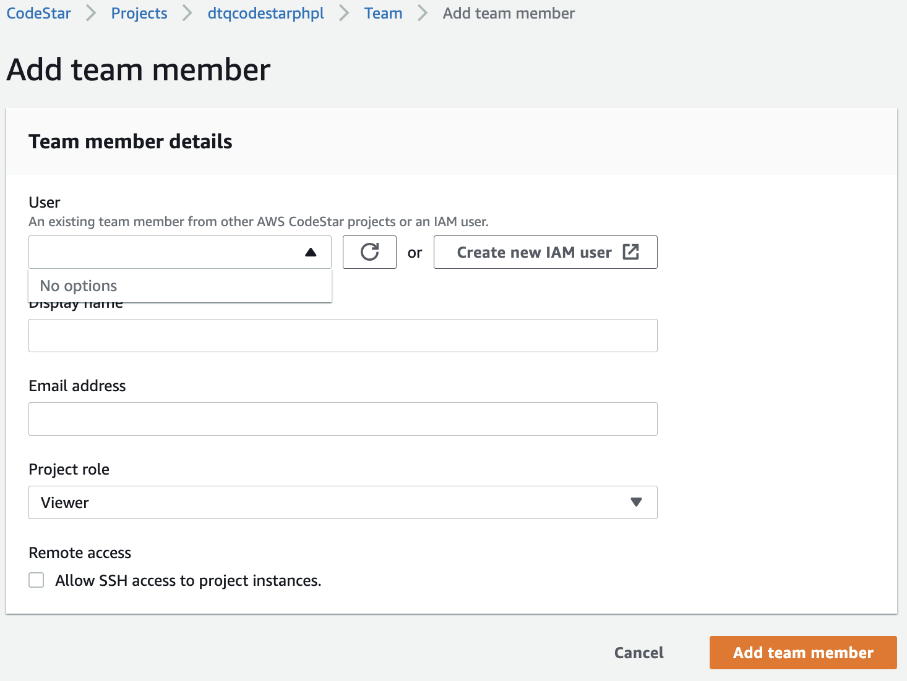

## AWS CloudFormation
- main stack is `xxx-infrastructure`
- create change set
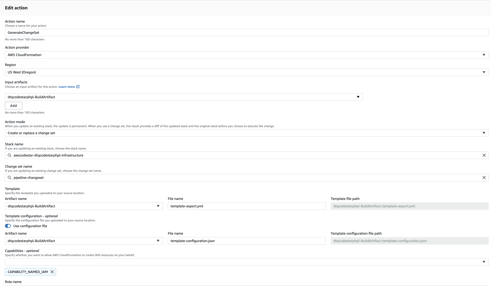
- execute change set
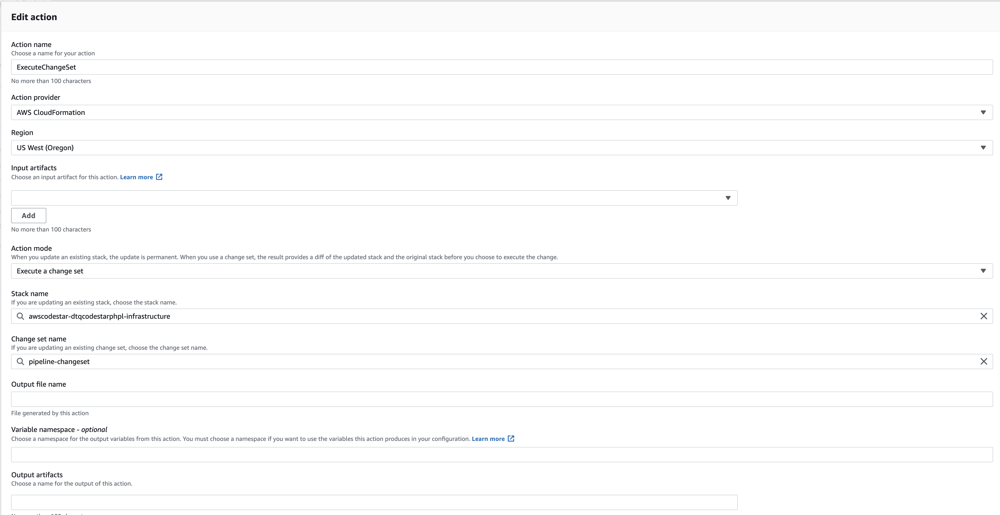

## output result
- Codestar click `View application`
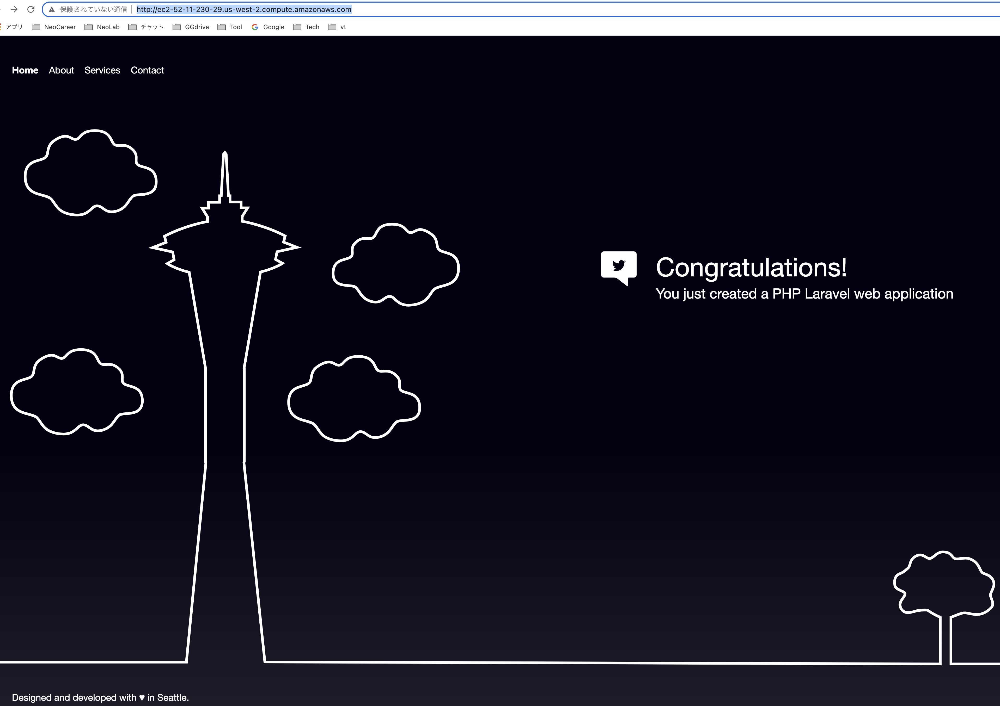